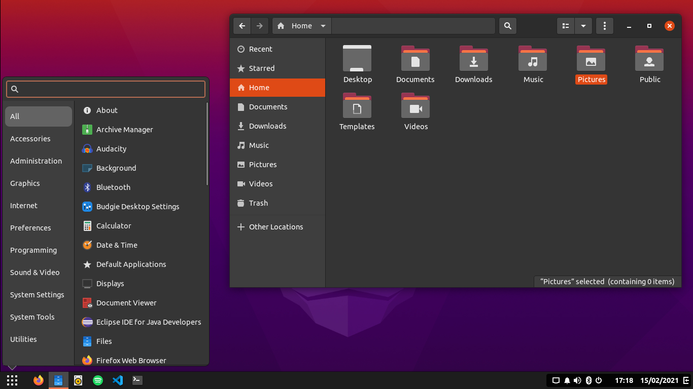
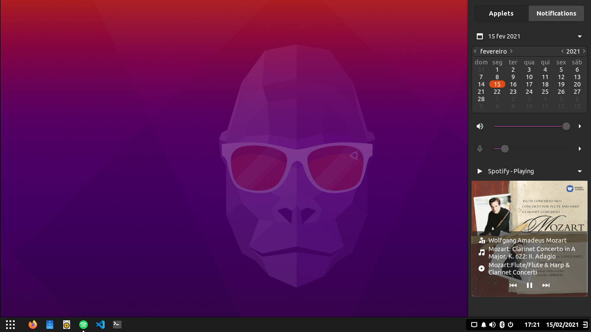

# Yaru-Budgie
Simple port of budgie-specific CSS for the default Ubuntu Yaru's theme

How to use it: 

<b>0-)</b> Select the original Yaru-Dark theme from Budgie desktop settings

<b>1-)</b> Put https://github.com/speltriao/Yaru-Dark-Budgie-theme/blob/main/gtk.css (gtk.css) file in /home/$USER/.config/gtk-3.0 and save. If the folder/file doesn't exist, create it.

<b>2-)</b> Select the Yaru theme from your budgie-settings 
 

<b>3-)</b> Log out and log in. Done! 
 

<b>Recomended icons:</b> Papirus-Dark with Yaru folders (see: https://github.com/PapirusDevelopmentTeam/papirus-folders ).

--><i>The default Yaru icon theme does NOT support Budgie </i>--<

  

It's heavily based on https://github.com/darkomarko42/Marwaita-ubuntu so I followed the GNU GPL3 license (as stated on .CSS file).

